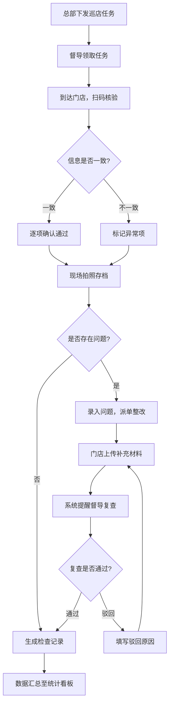

## 1. 产品概述

医生资质公示移动 App，面向医美机构运营督导在巡店时使用，聚焦现场核对和问题闭环管理。督导通过 App 领取总部下发的门店检查任务，现场扫码核验医生资质信息，拍照取证，发现问题即时派单整改，跟踪复查闭环，最终汇总数据支撑月度运营会议。

- 目标用户：医美机构运营督导、门店负责人
- 核心价值：确保门店医生资质公示合规，问题发现→派单→整改→复查全流程闭环，降低合规风险
- 目标：提升巡店效率 50%，问题闭环率提升至 95% 以上，证照到期提前预警

## 2. 核心功能

### 2.1 用户角色

| 角色 | 注册方式 | 核心权限 |
|------|----------|----------|
| 运营督导 | 总部分配账号 | 领取任务、扫码核验、拍照、派单、复查确认、查看看板 |
| 门店负责人 | 总部分配账号 | 接收整改单、上传补充材料、查看本店记录 |

### 2.2 功能模块

1. **巡店任务**：任务列表、任务领取、任务状态跟踪、门店信息展示
2. **扫码核验**：扫描前台公示二维码、核对线上信息、逐项确认医生证照/执业地点/项目权限
3. **现场拍照**：拍摄公示栏照片、拍摄医生工牌照片、照片标注与关联
4. **整改派单**：选择问题类型、填写说明、指定门店负责人、设置整改截止时间
5. **复查确认**：查看整改材料、复查通过/驳回、生成检查记录
6. **统计看板**：高频问题门店排名、即将到期证照预警、月度巡店完成率、问题闭环率

### 2.3 页面详情

| 页面名称 | 模块名称 | 功能描述 |
|----------|----------|----------|
| 巡店任务 | 任务列表 | 展示待领取、进行中、已完成的巡店任务，支持按状态筛选 |
| 巡店任务 | 任务详情 | 展示门店名称、地址、检查项目清单、截止日期 |
| 巡店任务 | 领取任务 | 督导一键领取总部下发的检查任务 |
| 扫码核验 | 扫码入口 | 调用摄像头扫描前台公示二维码 |
| 扫码核验 | 信息核对 | 自动拉取线上医生资质信息，逐项比对公示内容 |
| 扫码核验 | 核验确认 | 逐项确认证照、执业地点、项目权限是否一致，标记异常项 |
| 现场拍照 | 拍照入口 | 调用摄像头拍摄公示栏和医生工牌 |
| 现场拍照 | 照片管理 | 预览、重拍、删除照片，添加标注说明 |
| 整改派单 | 问题录入 | 选择问题类型（缺失/不一致/过期等），填写详细说明 |
| 整改派单 | 派单操作 | 指定门店负责人，设置整改截止时间，提交派单 |
| 复查确认 | 整改单列表 | 展示待复查的整改单，门店已上传的补充材料 |
| 复查确认 | 复查操作 | 查看整改材料，通过或驳回，驳回需填写原因 |
| 复查确认 | 检查记录 | 复查通过后自动生成完整检查记录 |
| 统计看板 | 问题门店排名 | 高频问题门店 Top 排行，问题数量和类型分布 |
| 统计看板 | 证照预警 | 即将到期证照列表，按到期时间排序 |
| 统计看板 | 完成率统计 | 月度巡店完成率、问题闭环率趋势图 |

## 3. 核心流程

督导领取总部下发的巡店任务 → 到达门店后扫描前台公示二维码 → 系统自动拉取线上医生资质信息进行比对 → 督导逐项确认证照、执业地点、项目权限 → 拍摄公示栏和工牌照片存档 → 如发现缺失或异常，选择问题类型并填写说明 → 直接派单给门店负责人，设置整改截止时间 → 门店上传补充材料后系统提醒督导复查 → 督导复查通过后生成检查记录 → 数据自动汇总至统计看板

## 4. 用户界面设计

### 4.1 设计风格

- 主色调：深青色(#0F766E) 代表专业与信任，辅助色：琥珀色(#F59E0B) 用于警示和强调
- 按钮风格：圆角胶囊按钮，主操作使用实心填充，次要操作使用描边
- 字体：标题使用思源黑体/Noto Sans SC Bold，正文使用系统默认 Sans-serif
- 布局风格：底部 Tab 导航，卡片式内容布局，移动端优先
- 图标风格：线性图标，统一使用 Lucide 图标库
- 整体风格：医疗专业感 + 移动端高效操作，信息密度适中，操作路径短

### 4.2 页面设计概览

| 页面名称 | 模块名称 | UI 元素 |
|----------|----------|---------|
| 巡店任务 | 任务列表 | 卡片列表，状态标签（待领取/进行中/已完成），筛选 Tab，下拉刷新 |
| 巡店任务 | 任务详情 | 门店信息卡片，检查项目清单，底部操作按钮 |
| 扫码核验 | 扫码界面 | 全屏摄像头取景框，中央扫码框，顶部返回和手电筒按钮 |
| 扫码核验 | 核验清单 | 医生信息卡片，逐项勾选确认，异常项红色标记 |
| 现场拍照 | 拍照界面 | 拍照按钮，照片缩略图列表，标注输入框 |
| 整改派单 | 问题表单 | 问题类型选择器，文本输入框，负责人选择，日期选择器 |
| 整改派单 | 派单确认 | 信息预览卡片，提交按钮 |
| 复查确认 | 整改单列表 | 卡片列表，整改状态标签，倒计时提示 |
| 复查确认 | 复查详情 | 整改材料预览，通过/驳回按钮，驳回原因输入 |
| 统计看板 | 数据概览 | 数字卡片（完成率/闭环率），柱状图/折线图，预警列表 |

### 4.3 响应式设计

- 移动优先设计，适配 375px-428px 宽度手机屏幕
- 触控优化：按钮最小点击区域 44px，列表项支持左滑操作
- 底部安全区域适配（iPhone 刘海屏等）

### 4.4 3D 场景

不适用
