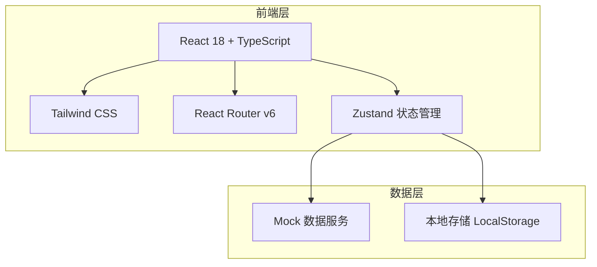
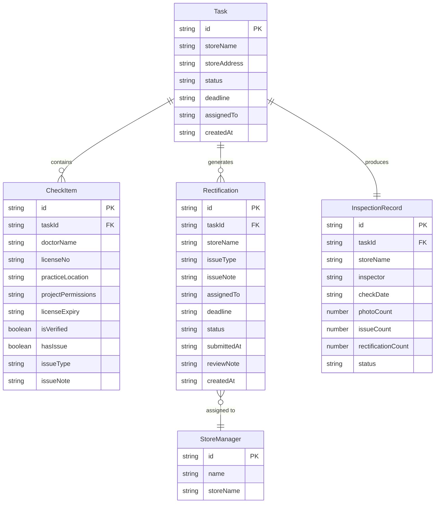

## 1. 架构设计



## 2. 技术说明

- 前端：React@18 + TypeScript + Tailwind CSS@3 + Vite
- 初始化工具：vite-init（react-ts 模板）
- 后端：无（纯前端项目，使用 Mock 数据模拟）
- 数据库：无（使用 Zustand + LocalStorage 进行状态持久化）
- 状态管理：Zustand
- 路由：React Router v6
- 图标：lucide-react
- 图表：recharts

## 3. 路由定义

| 路由 | 用途 |
|------|------|
| / | 重定向到 /tasks |
| /tasks | 巡店任务页面 - 任务列表和任务详情 |
| /scan | 扫码核验页面 - 扫码和信息核对 |
| /photo | 现场拍照页面 - 拍摄和照片管理 |
| /rectify | 整改派单页面 - 问题录入和派单 |
| /review | 复查确认页面 - 整改单列表和复查操作 |
| /dashboard | 统计看板页面 - 数据汇总和图表 |

## 4. API 定义

无后端 API，使用 Mock 数据服务模拟以下接口：

```typescript
interface Task {
  id: string
  storeName: string
  storeAddress: string
  status: "pending" | "in_progress" | "completed"
  checkItems: CheckItem[]
  deadline: string
  assignedTo: string
  createdAt: string
}

interface CheckItem {
  id: string
  doctorName: string
  licenseNo: string
  practiceLocation: string
  projectPermissions: string[]
  licenseExpiry: string
  isVerified: boolean
  hasIssue: boolean
  issueType?: string
  issueNote?: string
}

interface Rectification {
  id: string
  taskId: string
  storeName: string
  issueType: string
  issueNote: string
  assignedTo: string
  deadline: string
  status: "pending" | "submitted" | "reviewing" | "passed" | "rejected"
  submittedAt?: string
  submittedMaterials?: string[]
  reviewNote?: string
  createdAt: string
}

interface InspectionRecord {
  id: string
  taskId: string
  storeName: string
  inspector: string
  checkDate: string
  photoCount: number
  issueCount: number
  rectificationCount: number
  status: "completed" | "has_issues"
}

interface DashboardStats {
  totalTasks: number
  completedTasks: number
  completionRate: number
  totalIssues: number
  closedIssues: number
  closureRate: number
  topProblemStores: { storeName: string; issueCount: number }[]
  expiringLicenses: { doctorName: string; licenseNo: string; expiryDate: string; storeName: string }[]
  monthlyTrend: { month: string; tasks: number; issues: number; closedRate: number }[]
}
```

## 5. 服务端架构图

不适用（纯前端项目）

## 6. 数据模型

### 6.1 数据模型定义



### 6.2 数据定义语言

不适用（无数据库，使用 Mock 数据 + LocalStorage）
